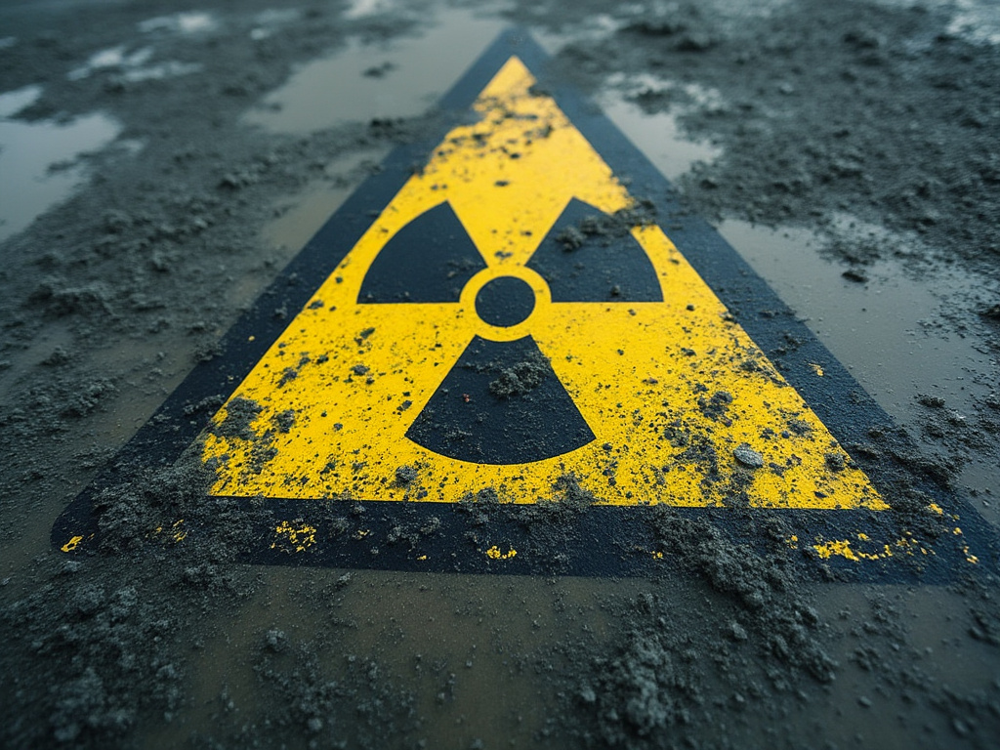
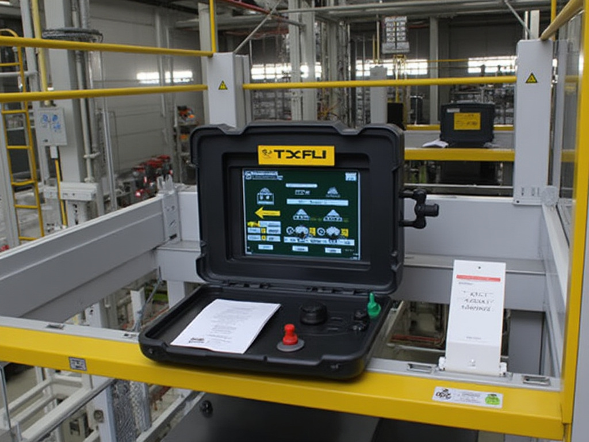
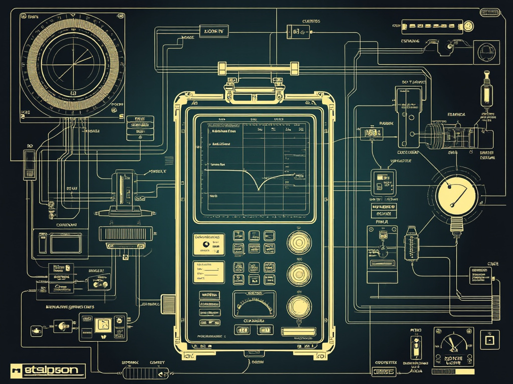
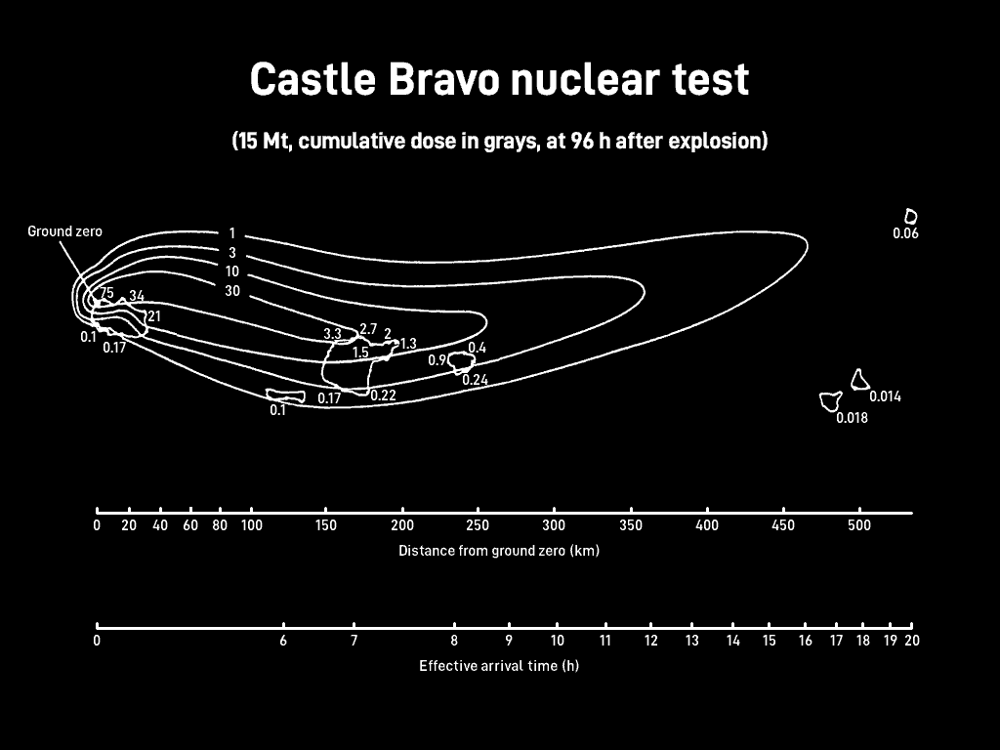

# The ionizing radiation field guide

© 2024-2025 Gissio (v2025-04-06)

Welcome to the fascinating world of Geiger counters! Whether you're considering buying one or already own one and want to unlock its potential, this guide is for you. We'll explore the essentials of ionizing radiation, how Geiger counters work, and practical ways to explore this invisible energy around us. Let's dive in!

## What do Geiger counters measure?

Geiger counters measure **ionizing radiation**—tiny, super-energetic particles that can knock electrons off atoms. This process, called **ionization**, is particularly hazardous to biological tissues, as it can break chemical bonds, harm DNA, and generate free radicals which in turn can cause further damage.

## What is a radioactive substance?

A **radioactive substance** contains unstable atoms that spontaneously break apart, releasing ionizing radiation. As they decay, these atoms transform into different **isotopes**—variations of elements with different numbers of neutrons.

This decay happens at a predictable rate called the **half-life**, the time it takes for half the radioactive atoms in a sample to decay. Picture a bag with 100 popping popcorn kernels. If half pop every minute, you'd have 50 left after 1 minute, 25 after 2 minutes, and so on. That's half-life at work!

Examples of radioactive materials include granite tabletops (which may contain traces of uranium), old uranium-glazed ceramics, potassium chloride (containing a naturally radioactive potassium isotope), and medical isotopes like iodine-131, used in treatments such as thyroid therapy.

## What is radioactive contamination?

Radioactive contamination occurs when radioactive substances spread to places where they are neither intended nor desired.

This contamination can be divided into two types:

* **External contamination**, where radioactive substances settle on external surfaces like skin, clothing, or other objects.
* **Internal contamination**, where radioactive substances enter the body through inhalation, ingestion, or absorption through open wounds, posing a significant danger due to the close-range interaction with biological tissues.

Decontamination is the process of removing radioactive particles from external surfaces. By simply removing clothing and shoes, one can eliminate about 90% of external contamination. A gentle wash with soap and water further removes radiation particles from the skin, preventing the spread of radioactive substances and reducing the risk of internal contamination.

For internal contamination, specific treatments are used. If contaminated with iodine-131, one might take potassium iodide to saturate the thyroid, thus blocking the uptake of the radioactive iodine. For contamination with cesium-137, Prussian blue can be administered to bind with the radioactive particles, which then exit the body through natural means.

## What types of ionizing radiation are there?

Ionizing radiation includes several types, each varying in energy, penetration ability, and interaction with matter:

* **Gamma rays (γ)** are high-energy photons produced during nuclear reactions. They are highly penetrating and require significant shielding, such as several centimeters of lead or meters of concrete. Their energy levels span from 100 keV to 8 MeV.
* **X-rays** are similar to gamma rays but of lower energy. They are less penetrating but still require substantial shielding. Their energy ranges from 100 eV to 100 keV.
* **Beta particles (β)** comprise fast-moving electrons or positrons and have moderate penetration. They can be stopped by a few millimeters of aluminum or several meters of air. Energy levels are from a few keV to tens of MeV.
* **Alpha particles (α)** are composed of helium nuclei (two protons and two neutrons). They have low penetration but high ionization capacity, and can be blocked by just a few centimeters of air, a sheet of paper, or even the outer layer of human skin. Their energy typically falls between 3 and 7 MeV.
* **Neutrons (n)**  pose a unique danger as they can make other materials radioactive upon collision. Effective shielding for neutrons involves hydrogen-rich materials like water or plastic. Neutron energies vary from less than 1 eV for slow neutrons to over 1 MeV for fast ones.

In general, the higher the energy of the radiation, the more potential damage it can inflict.

## How is ionizing radiation measured?

Ionizing radiation is measured using several metrics:

### Absorbed dose and rate

**Absorbed dose** refers to the amount of energy deposited by ionizing radiation per unit mass of any material. It is measured in grays (Gy) in the SI system, where 1 gray equals 1 joule of energy absorbed per kilogram of matter. In older units, it's measured in rads, where 1 rad equals 0.01 gray.

**Absorbed rate** is absorbed dose per unit of time.

This measurement quantifies the **physical impact** of radiation but does not directly account for the biological effects, which depend on the type of radiation.

### Equivalent dose and rate

**Equivalent dose** is a measure that reflects the **biological damage** to human tissue from exposure to ionizing radiation. It takes into account not only the absorbed dose (energy deposited per unit mass) but also the biological effectiveness WR of the radiation type, known as the radiation weighting factor. Equivalent dose is measured in sieverts (Sv) in the SI system, where 1 sievert equals the amount of radiation that would have the same biological effect as 1 gray of gamma rays or X-rays. In older units, it's measured in rems, where 1 rem equals 0.01 sievert.

The WR value varies depending on the type and energy of the radiation, reflecting its potential to cause biological harm. Common WR values include:

* **Gamma rays and X-rays:** WR = 1 (used as the reference standard).
* **Beta particles:** WR = 1 (similar biological effect to gamma rays).
* **Alpha particles:** WR = 20 (highly damaging due to their high ionization capacity over a short range).
* **Neutrons:** WR varies with energy:
  * < 10 keV: WR = 5
  * 10 keV to 100 keV: WR = 10
  * 100 keV to 2 MeV: WR = 20 (peak effectiveness)
  * 2 MeV to 20 MeV: WR = 10
  * 20 MeV: WR = 5

**Equivalent rate** is equivalent dose per unit of time.

This measurement allows for a more accurate assessment of radiation risk to biological tissues by factoring in how different types of radiation interact with living matter. For example, an absorbed dose of 1 gray from alpha particles (WR = 20) would result in an equivalent dose of 20 sieverts, indicating significantly greater biological damage than the same absorbed dose from gamma rays (WR = 1), which would be 1 sievert.

### Activity

**Activity** refers to the rate at which a radioactive substance decays, or in other words, how many unstable atoms break apart per unit of time, releasing ionizing radiation. It's a measure of a source's strength—how active or "hot" a radioactive material is— and is quantified in becquerels (Bq) in the SI system, where 1 becquerel equals 1 decay per second. In older units, it's measured in curies (Ci), where 1 curie equals 3.7 × 10¹⁰ decays per second.

For example, in a sample with an activity of 1 MBq (1 million becquerels), 1 million atoms are decaying every second, emitting radiation in the process.

It's important to note that Geiger counters measure dose and rate—properties related to the radiation absorbed by a target—rather than activity, which is a characteristic of the source itself. Nevertheless, understanding activity is crucial for assessing the potential hazard of a radioactive material, as it directly influences the intensity of radiation emitted and, consequently, the precautions needed for safe handling or disposal.

## How dangerous is ionizing radiation?

Ionizing radiation can be harmful in a way that's largely analogous to how UV radiation from the sun causes sunburns, but with effects that are more severe and can occur internally.

Here's a brief breakdown of doses considered safe:

* **Natural background radiation:** The natural background radiation is on average 2.4 mSv per year, which translates to about 0.27 μSv per hour.

* **Public exposure limits:** The International Commission on Radiological Protection (ICRP) suggests an annual effective dose limit for the general public of 1 mSv, in addition to natural background radiation.

* **Occupational exposure limits:** For workers in fields involving radiation exposure (like nuclear power or medical imaging), the ICRP recommends an average of 20 mSv per year over 5 years, with no single year exceeding 50 mSv.

Here's how higher radiation doses can impact health:

* **Low Dose (<100 mSv):** This is somewhat akin to a mild sunburn. Effects might not be immediately visible; cells can repair most of the damage. However, there's an increased risk of cancer over time, much like frequent mild sunburns might lead to skin cancer.

* **Moderate dose (100-1000 mSv):** Similar to a moderate to severe sunburn, this dose might lead to temporary changes in blood chemistry. Symptoms could include nausea, with a more pronounced long-term cancer risk. This is comparable to when a severe sunburn causes skin peeling, swelling, and pain.

* **High dose (1-5 Sv):** Analogous to a severe burn, this level can cause acute radiation syndrome (ARS), with symptoms like severe nausea, vomiting, hair loss, and bone marrow damage, weakening the immune system. Survival is possible with medical intervention, but with lasting health effects. This is like dealing with severe, deep burns that require medical treatment.

* **Very high dose (>5 Sv):** This is catastrophic, akin to third-degree burns. Radiation at this level can impair the central nervous system, leading to disorientation, loss of consciousness, and death within days or weeks without immediate medical intervention. The damage is so extensive that it can be fatal or cause severe disfigurement.

This analogy helps in understanding the severity of radiation effects, but it's crucial to remember that ionizing radiation affects the entire body, not just the skin, and its effects can be cumulative and delayed, unlike the immediate feedback from UV radiation exposure.

## How does a Geiger counter work?

A Geiger counter detects ionizing radiation using a gas-filled tube called a Geiger-Müller tube.

Here's a brief overview of how it works:

* **Radiation interaction:** When ionizing radiation enters the tube, it ionizes some of the gas atoms inside, creating ion pairs (ions and electrons).

* **Amplification:** The tube has a high voltage applied across it. The electrons from the ion pairs are accelerated towards the anode (positive electrode), gaining enough energy to ionize more gas atoms in a chain reaction, which amplifies the initial ionization event.

* **Pulse generation:** This avalanche of ions results in a sudden surge of electrical current, creating a detectable electrical pulse. Each pulse corresponds to a single ionizing event.

* **Counting:** The pulses are counted by electronic circuits, often converting the count into an audible click or visual display, giving an indication of radiation levels. The number of clicks or counts per minute (cpm) reflects the intensity of the radiation.

## How do Geiger counters respond to different types of radiation?

Geiger tubes respond differently to various types of ionizing radiation:

* **Gamma rays and X-rays:** Being high-energy photons, Gamma and X-rays can easily penetrate the walls of a Geiger tube. Detection efficiency typically peaks in the mid-energy range, roughly between 100 keV to 1 MeV.

* **Beta particles:** Beta particles can enter the Geiger tube if its walls are thin enough. Detection efficiency generally increases with energy.

* **Alpha particles:** Most Geiger tubes cannot detect alpha particles because these particles cannot pass through the tube's walls. However, "Pancake" Geiger tubes, equipped with a very thin window made of mica or thin metal, can detect alpha particles, but only if the source is very close due to their limited range.

* **Neutrons:** Standard Geiger tubes are not directly sensitive to neutrons since neutrons, being uncharged, don't ionize gas directly. However, specialized tubes exist that convert neutrons into other particles that can be detected.

A Geiger tube's **sensitivity** measures how effectively it detects and responds to ionizing radiation. It is typically expressed as counts per minute (cpm) per unit of radiation rate (for instance, microsieverts per hour). Sensitivity depends on factors like:

* **Tube design:** Size, wall material, thickness and gas composition.
* **Radiation type:** Alpha, beta, gamma or neutron.
* **Radiation energy:** Higher-energy particles are usually easier to detect.
* **Radiation intensity:** The rate of incoming particles can affect the count rate.

The Soviet-era SBM-20, for example, is a metal-cased Geiger tube designed primarily for detecting gamma and beta radiation. Its sensitivity varies by source as follows:

* **Cesium-137 (662 keV gamma):** Approximately 120 cpm/µSv/h.
* **Radium-226 (mixed emissions):** Around 200 cpm/µSv/h.
* **Cobalt-60 (1.17 and 1.33 MeV gamma):**: About 150 cpm/µSv/h.

Manufacturers typically provide sensitivity values under standardized conditions, but calibration with known radioactive sources can refine accuracy.

It is important to note that for common Geiger tubes, radiation rate and dose estimates are accurate only if the radiation source is known and the correct sensitivity value is used. Without this, measurements can be significantly inaccurate, as sensitivity varies with radiation type.

## What is an energy-compensated Geiger tube?

An energy-compensated Geiger tube is a type of Geiger-Müller tube designed to measure radiation more accurately across different energy levels of ionizing radiation. It includes additional materials or structures, like filters or windows, that adjust the response of the tube so that it detects radiation with a sensitivity that is more uniform across various energies. This compensation helps to ensure that the readings are not disproportionately influenced by either low-energy or high-energy particles, providing a more accurate measure of total radiation exposure.

## Applications of Geiger counters

### Mineral exploration

Geologists use Geiger counters to detect uranium, thorium, and other radioactive minerals, aiding in the mapping of geological structures.

Although Uranium-238, the most common uranium isotope, decays into Thorium-234 via alpha emission (which is typically not detectable by standard Geiger counters unless they have a mica window), the [decay chain](https://en.wikipedia.org/wiki/Decay_chain#Radium_series) continues, with subsequent daughter products emitting detectable beta radiation.

Likewise, Thorium-232, the primary isotope of thorium, undergoes a [decay sequence](https://en.wikipedia.org/wiki/Decay_chain#Thorium_series) that results in the emission of detectable beta radiation from its daughter products.

### Radiation monitoring

Geiger counters are essential for monitoring radiation levels in areas affected by nuclear accidents or at sites of radioactive waste disposal. They help in assessing contamination levels in soil, water, and air.

Due to their biological effects, persistence in the environment, and the volume released during nuclear accidents, the following isotopes are primary concerns during nuclear accidents:

* **Iodine-131:** A gamma emitter with a half-life of approximately 8 days, this isotope is particularly hazardous due to its uptake by the thyroid gland, which can lead to thyroid cancer with significant exposure. It was notably released during the Chernobyl and Fukushima disasters.

* **Cesium-137:** A gamma emitter with a half-life of around 30 years, it makes a significant long-term environmental pollutant. Cesium-137 contaminates soil and water, leading to prolonged radiation exposure. It played a critical role in both the Chernobyl and Fukushima incidents.

* **Strontium-90:** This beta emitter, with a half-life of about 29 years, has a tendency to accumulate in bones, where it mimics calcium. It was significantly released during the Chernobyl disaster and remains a concern in other nuclear events.

Additionally, other isotopes like cesium-134, strontium-89 and various plutonium isotopes can also be released, though they are either less abundant or pose less immediate danger in the context of nuclear accidents.

### Radiation therapy oversight

In healthcare settings, Geiger counters are used to monitor for radiation leaks from equipment such as X-ray machines and radiotherapy units, ensuring the safety of both patients and staff.

In the field of radiation therapy, several isotopes are employed for both diagnostic and therapeutic applications:

* **Iodine-131:** Primarily used for treating thyroid cancer. It is administered orally and is absorbed by thyroid cells, including cancer cells, where it emits beta particles to destroy them.

* **Iodine-125:** Used in brachytherapy, especially for prostate cancer, where tiny "seeds" containing the isotope are implanted directly into the tumor to deliver radiation over time.

* **Cobalt-60:** Traditionally used in teletherapy for external beam radiation therapy, though its use has declined with the rise of linear accelerators. It can still be used for certain treatments due to its gamma ray emissions.

* **Iridium-192:** Another isotope used in brachytherapy, particularly in high-dose-rate (HDR) treatments where the source is temporarily placed within the body to treat cancers like those of the cervix, breast, and prostate.

* **Cesium-137:** Has been used in brachytherapy for gynecologic treatments, though less commonly now due to availability issues.

* **Yttrium-90:** Utilized in targeted therapies like selective internal radiation therapy (SIRT) for liver tumors and in radioimmunotherapy for certain lymphomas.

* **Radium-223:** Specifically used for the treatment of bone metastases from prostate cancer. It targets bone tissue, sparing surrounding healthy tissues due to its alpha particle emissions.

* **Lutetium-177:** Increasingly used in peptide receptor radionuclide therapy (PRRT) for neuroendocrine tumors, where it is linked to peptides that target tumor cells.

All these isotopes emit beta and gamma radiation, which can be detected by standard Geiger counters.

### Food and water safety

To ensure the safety of imported food, many countries use Geiger counters to screen for radioactive isotopes, particularly from regions impacted by nuclear incidents or elevated background radiation. This ensures imports stay within acceptable radiation limits.

Geiger counters are also valuable for testing food and water after nuclear event. The Codex Alimentarius, developed by the FAO and WHO, provide post-emergency guidelines, setting **activity concentration** limits in food at 1,000 Bq/kg for cesium-134 and cesium-137, and 100 Bq/kg for strontium-90 and iodine-131. For drinking water, many governments adopt an emergency limit of 10 Bq/kg for cesium-134, cesium-137 and stronium-90.

Since Geiger counters measure counts per minute (cpm) rather than Bq/kg, a conversion is necessary to compare readings against safety standards. Here's a practical step-by-step guide:

1. **Measure background radiation:** Record the background cpm over an extended averaging period for precision.

2. **Measure sample radiation:** Place the Geiger counter at certain distance (e.g., 10 cm) from the sample (e.g., 1 kg of grain, vegetables or meat) and record the sample cpm, again using a long averaging period.

3. **Calculate net cpm:** Subtract the background cpm from the sample cpm to isolate the sample's radiation.

4. **Calibrate the counter:** Determine the cpm-to-Bq conversion factor.
   * *With a [check source](https://ludlums.com/documents/technical-articles/417-check-sources-2)*: Use a known source (e.g., 1 μCi or 37,000 Bq of cesium-137), measure its cpm above background under the same conditions as the sample, and calculate the factor. For example, if 37,000 Bq at 5 cm yields 160 cpm, the factor is 37,000 Bq ÷ 160 cpm ≈ 231 Bq/cpm.
   * *Without a check source*: Estimate the factor using an [activity-rate calculator](http://www.radprocalculator.com/Gamma.aspx). For example, if 37,000 Bq at 5 cm produces 1.132 µSv/h and the tube's sensitivity is 130 cpm/µSv/h, the factor is 37,000 Bq ÷ (1.132 µSv/h × 130 cpm/µSv/h) ≈ 251 Bq/cpm.

5. **Estimate activity:** Multiply the net cpm by the conversion factor. For example, a net cpm of 20 with a factor of 250 Bq/cpm results in an activity of 5,000 Bq.

6. **Check against limits:** Divide the activity (Bq) by the sample weight (kg) to get the activity concentration (Bq/kg). Compare this to Codex or local standards. If it exceeds the threshold, the sample may be unsafe.

**Key considerations:**

* **Check source decay:** A check source's activity decreases over time following the exponential law: $A = A_0 \left(\frac{1}{2}\right)^\frac{t}{T_{1/2}}$. Here, A is the current activity, $A_0$ is the initial activity (from the label), $T_{1/2}$ is the half-life, and $t$ is the time elapsed since the label date (in matching units).
* **Tube sensitivity:** Most Geiger tubes are quite insensitive to the low radiation levels deemed safe, requiring extended averaging periods to minimize measurement error.
* **Isotope sensitivity:** Geiger counters measure radiation but cannot distinguish between isotopes. Codex limits are isotope-specific, so elevated readings might stem from harmless sources (e.g., potassium-40) rather than regulated isotopes like cesium-137.
* **Energy sensitivity:** A Geiger tube’s response varies with radiation energy, affecting accuracy unless calibrated for the specific isotopes of concern.

### Nuclear strike

Surviving a nuclear strike requires quick action to minimize exposure to radiation, secure basic needs, and monitor your environment. Here's a step-by-step guide:

1. **Seek shelter immediately**
   * If you're not already in a safe spot, move to a sturdy building, preferably underground (e.g., a basement). The goal is to put as much mass—concrete, earth, or brick—between you and the radioactive fallout.
   * Stay indoors for at least 48-96 hours, as fallout radiation decreases significantly after the first day or two.
2. **Seal your environment**
   * Close all windows, doors, and vents. Use duct tape or plastic sheeting to seal gaps and prevent contaminated air from entering.
3. **Decontaminate uourself**
   * If you were outside during or after the blast, remove outer clothing and seal it in a plastic bag. Store it away from living areas.
   * Wash your skin with soap and water to remove radioactive particles. Avoid scrubbing too hard, which could damage skin and increase absorption.
4. **Monitor radiation levels**
   * Use a Geiger counter to assess your surroundings periodically:
      * Below 10 µSv/h: Safe background radiation.
      * 0.5-1 mSv/h: Elevated but manageable for brief exposure (e.g., quick outdoor tasks). 
      * 5-10 mSv/h: Dangerous—limit exposure to minutes and stay sheltered.
      * Above 10 mSv/h: Extremely risky—most Geiger counters max out here. Assume higher levels, reinforce shelter, or evacuate if possible.
5. **Secure supplies**
   * Stock at least two weeks of sealed, non-perishable food and water.
   * Use only bottled or covered water; avoid local sources until confirmed uncontaminated.
   * Stay informed with a battery-powered radio.

## Experiments

**WARNING:** The authors of Rad Pro are not responsible or liable for any claims, damages, losses, expenses, costs, or liabilities whatsoever resulting or arising directly or indirectly from performing these experiments.

### Background radiation mapping

* **Objective:** Measure natural background radiation levels in different locations.

* **Method:** Use the Geiger counter to take readings in various environments (indoors, outdoors, at different altitudes, near geological formations, etc.). Compare these readings to understand how background radiation varies.

### Radiation from household items

* **Objective:** Identify items in your home that emit radiation.

* **Method:** Measure radiation from items like smoke detectors (which contain small amounts of Americium-241), old watches with radium dials, ceramic pottery with uranium glaze, or Brazilian granite countertops. Document the radiation levels and compare them to baseline background readings to see if they exceed typical values.

* **WARNING:** To prevent internal contamination, wear gloves when handling radioactive objects such as uranium rocks. Also, keep these objects in sealed plastic bags to reduce the risk of external contamination.

### Radiation shielding experiment

* **Objective:** Understand how different materials shield against radiation.

* **Method:** Place a known radioactive source (like a small piece of uranium ore or a radioactive check source) beside the Geiger counter and measure the count rate. Then, insert various materials (lead, aluminum, paper, wood, water) between the source and the counter, measuring the reduction in count rate for each material.

* **WARNING:** To prevent internal contamination, wear gloves when handling radioactive objects such as uranium rocks. Also, keep these objects in sealed plastic bags to reduce the risk of external contamination.

### Experiment with distance

* **Objective:** Demonstrate how radiation decreases with distance from the source.

* **Method:** Place a radioactive source at a fixed position and measure radiation levels at increasing distances from the source. Plot the count rate versus distance to confirm the [inverse square law](https://en.wikipedia.org/wiki/Inverse-square_law) (intensity ∝ 1/d²).

* **WARNING:** To prevent internal contamination, wear gloves when handling radioactive objects such as uranium rocks. Also, keep these objects in sealed plastic bags to reduce the risk of external contamination.

### Altitude effects on radiation

* **Objective:** Explore how background radiation changes with altitude.

* **Method:** Take the Geiger counter to higher altitudes—e.g., during a mountain hike, in an airplane flight, or on a weather balloon. Record radiation levels at different heights to see the increase in background radiation due to cosmic ray exposure.

### Radon gas decay

* **Objective:** Measure the half-life of radon gas decay products.

* **Method:** After rainfall, wipe a paper towel over the exterior of your car left outside to collect radon decay products. Squeeze out excess water, then measure the towel's cpm with a Geiger counter. Re-measure every 4 hours to track the decay in radiation levels over time.

## Links

* https://xkcd.com/radiation/ - an excellent visualization of ionizing radiation dose.
